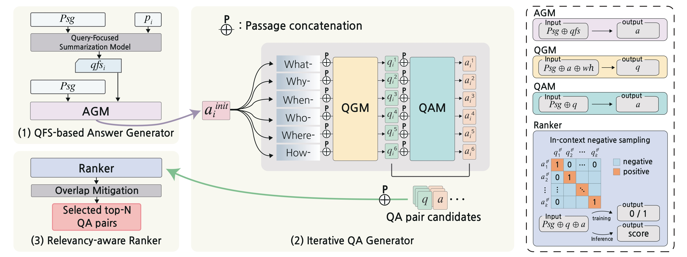

# Towards Diverse and Effective Question-Answer Pair Generation from Storybooks

This repository contains the source code and instructions to reproduce our paper, “Towards Diverse and Effective Question-Answer Pair Generation from Children Storybooks” (ACL 2023 - Findings)

Paper link: https://aclanthology.org/2023.findings-acl.380/

---

## Overview

We propose an effective QAGen framework that enhances diversity and quality in the QA pair generation. Our framework consists of a QFS-based answer generator, iterative QA generator, and relevancy-aware ranker. The overall QAG process of our framework is as below:



---

## Requirements and Installations

- requirements
    
    ```
    pip install -r requirements.txt
    ```
    
- Fairseq installation
    
    ```bash
    git clone https://github.com/facebookresearch/fairseq.git
    cd fairseq
    pip install --editable ./
    
    mv INTO_FAIRSEQ/* /path/to/fairseq/
    ```
    
- Clone QFS codes and download checkpoints
    
    ```bash
    https://github.com/salesforce/query-focused-sum.git
    # download this chekcpoint: segenc-qmsum-16384-512-wikisum-1

    mv for_QFS/* /path/to/query-focused-sum/multiencoder
    ```
    
- FairytaleQA dataset
    
    ```bash
    # Dataset(for training) download
    git clone [https://github.com/WorkInTheDark/FairytaleQA_QAG_System.git](https://github.com/WorkInTheDark/FairytaleQA_QAG_System.git)
    mv FairytaleQA_QAG_System/Fine-tune_BART/data /path/to/fairseq/data
    ```
    
- BART-large model
    
    ```bash
    # Download BPE
    wget -N 'https://dl.fbaipublicfiles.com/fairseq/gpt2_bpe/encoder.json'
    wget -N 'https://dl.fbaipublicfiles.com/fairseq/gpt2_bpe/vocab.bpe'
    wget -N 'https://dl.fbaipublicfiles.com/fairseq/gpt2_bpe/dict.txt'
    
    # Download BART-large model
    wget https://dl.fbaipublicfiles.com/fairseq/models/bart.large.tar.gz
    tar -xzvf bart.large.tar.gz
    ```
    

---

## Model training

- You can train each model by following the procedure given below.

(1) Answer Generation

[Answer Generation (Training)](agm.md)

(2) Question Generation

[Question Generation (Training)](qgm.md)

(3) Question Answering

[Question Answering (Training)](qam.md)

(4) Ranking model

[Ranking model (Training)](ranker.md)

---

## Generate QA pairs with your data

- Just input your own story and get generated QA pairs
- If you want to increase the number of generated QA pairs, please modify `--topk` in the code below

```bash
sh ./inference.sh /path/to/story/${story}.txt ${device}

# sh ./inference.sh test_inference/test.txt 0
```

→ Final QAGen outptut is in the “inference_result” folder

---

## Pre-trained Models

- Download below models and put them into `/path/to/fairseq`
- Due to the anonimity issue, we will further provide our model checkpoint.

---

## Generated QA Pair Samples

- Generated QA samples are also listed in the *Appendix* of our paper.
1. there was once upon a time a king who had a wife with golden hair , and she was so beautiful that you could n't find anyone like her in the world . it happened that she fell ill , and when she felt that she must soon die , she sent for the king , and said , ' if you want to marry after my death , make no one queen unless she is just as beautiful as i am , and has just such golden hair as i have . promise me this . ' after the king had promised her this , she closed her eyes and died . for a long time the king was not to be comforted , and he did not even think of taking a second wife . at last his councillors said , ' the king must marry again , so that we may have a queen . ' so messengers were sent far and wide to seek for a bride equal to the late queen in beauty . but there was no one in the wide world , and if there had been she could not have had such golden hair . then the messengers came home again , not having been able to find a queen . 

    
    `[Generated QA1]`
    Q: what did the queen tell the king to do if he wanted to marry after her death ?
    A: make no one queen unless she is just as beautiful as she is, and has just such golden hair as she has .
    
    `[Generated QA2]`
    
    Q: who was sent far and wide to seek for a bride equal to the late queen in beauty ?
    A: messengers . .
    
    `[Generated QA3]`
    Q: what happened to the queen after the king promised her this ?
    A: she closed her eyes and died .
    
    `[Generated QA4]`
    Q: why were messengers sent far and wide ?
    A: to seek for a bride equal to the late queen in beauty .
    
2. now , the king had a daughter , who was just as beautiful as her dead mother , and had just such golden hair . one day when she had grown up , her father looked at her , and saw that she was exactly like her mother , so he said to his councillors , ' i will marry my daughter to one of you , and she shall be queen , for she is exactly like her dead mother , and when i die her husband shall be king . ' but when the princess heard of her father 's decision , she was not at all pleased , and said to him , ' before i do your bidding , i must have three dresses ; one as golden as the sun , one as silver as the moon , and one as shining as the stars .
    
    `[Generated QA1]`
    
    Q: why did the king decide to marry his daughter to one of the councillors ?
    A: she was exactly like her dead mother and when she died her husband shall be king . 
    
    `[Generated QA2]`
    Q: what happened when the daughter grew up ?
    A: her father looked at her, and saw that she was exactly like her mother .
    
    `[Generated QA3]`
    Q: why did the princess feel when she heard of her father's decision ?
    A: not at all pleased .
    
    `[Generated QA4]`
    Q: who was just as beautiful as her dead mother, and had just such golden hair ?
    A: the king's daughter .
    

---

## Citation

- Please cite our paper if you use our framework:
@article{eo2023towards,
  title={Towards Diverse and Effective Question-Answer Pair Generation from Children Storybooks},
  author={Eo, Sugyeong and Moon, Hyeonseok and Kim, Jinsung and Hur, Yuna and Kim, Jeongwook and Lee, Songeun and Chun, Changwoo and Park, Sungsoo and Lim, Heuiseok},
  journal={arXiv preprint arXiv:2306.06605},
  year={2023}
}
---

## Great thanks

- Our framework is based on the [Fairseq](https://github.com/facebookresearch/fairseq) and [HuggingFace](https://github.com/huggingface/transformers)
- We thank the authors for sharing the [QFS](https://github.com/salesforce/query-focused-sum.git) model
